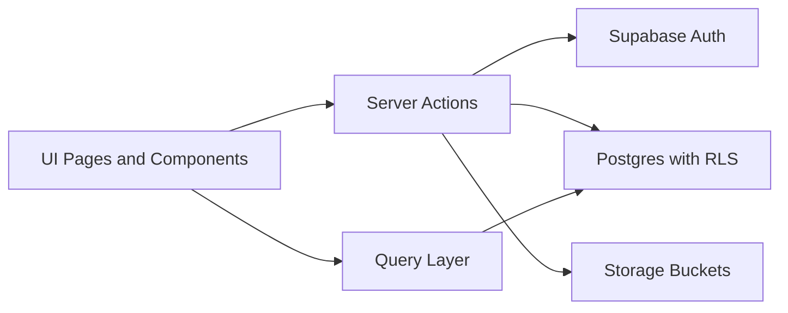
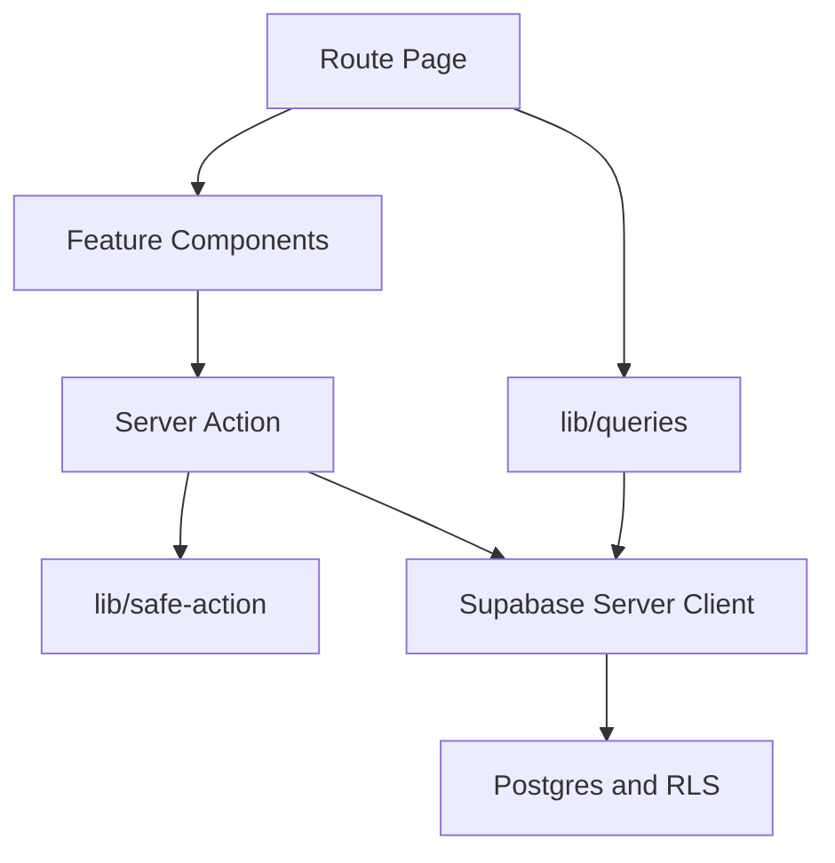
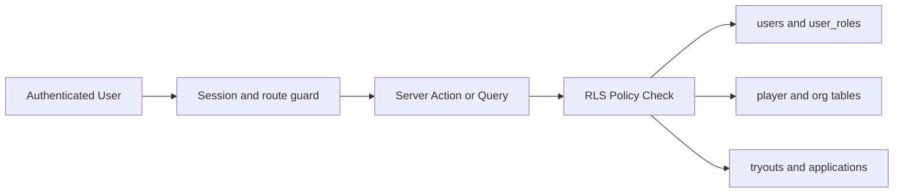

# GameFolio 6-Minute Presentation Pack (April 2026)

This file gives you ready answers for sections 3.1 to 3.6, plus likely questions from reviewers.
The wording is simple and based on the real project implementation.

## 0) 6-Minute Slide Flow

Use this timing to stay inside 6 minutes.

1. Slide 1 (0:00-0:30): Project title and one-line value
2. Slide 2 (0:30-1:20): 3.1 What is your project?
3. Slide 3 (1:20-2:10): 3.2 Key architecture characteristics
4. Slide 4 (2:10-3:00): 3.3 Chosen architecture style
5. Slide 5 (3:00-3:50): 3.4 Why it matches requirements
6. Slide 6 (3:50-4:55): 3.5 Code quality practices
7. Slide 7 (4:55-5:40): 3.6 Code structure and database layers
8. Slide 8 (5:40-6:00): Risks, next steps, and Q&A transition

---

## 3.1 What Is Your Project?

### Short Answer (for slide)

GameFolio is a role-based esports recruiting platform.
It solves a common problem: recruitment is often unstructured and spread across Discord messages, social media DMs, and manual spreadsheets.

GameFolio puts this in one system:

- Players create a clear profile with game stats and highlights
- Recruiters post tryouts and manage applications
- Admins moderate tryouts and user behavior

Target users:

- Player
- Recruiter / Organization member
- Platform Admin

### Speaker Notes (about 45 seconds)

"Our project is GameFolio, a web platform for esports recruiting. The main problem is fragmented hiring workflows. Players and teams use many channels with no standard format. We solved this by creating one platform with role-based access. Players build profiles and apply to tryouts. Recruiters manage rosters and applications. Admins moderate the platform for safety and quality."

---

## 3.2 Key Architecture Characteristics

### Most Important Quality Attributes

1. Security and access control
2. Maintainability and modularity
3. Performance and responsiveness
4. Reliability and consistency
5. Testability

### What this means in GameFolio

1. Security: access checks exist in middleware, route/layout logic, server actions, and database RLS.
2. Maintainability: feature folders, route groups, and shared action/query helpers reduce duplication.
3. Performance: Server Components are default, and server queries use request-level caching.
4. Reliability: clear loading and error boundaries plus controlled action responses.
5. Testability: action, unit, component, and end-to-end tests cover core flows.

### Speaker Notes (about 50 seconds)

"The architecture is designed around five qualities: security, maintainability, performance, reliability, and testability. Security is our top priority because this is a role-based system with private data. Maintainability matters because we have player, recruiter, and admin domains in one app. Performance is improved using server-first rendering and cached server queries. Reliability comes from standardized action results and route-level loading and error handling. Finally, we keep quality with automated tests across key flows."

---

## 3.3 What System Architecture Did You Choose?

### Architectural Style

We use a server-centric modular monolith with layered architecture.

- One deployable Next.js application
- Clear internal layers and boundaries
- Supabase as backend service (Auth, Postgres, Storage)

### Layer View

- Presentation layer: App Router routes and UI components
- Application layer: server actions with validation and role checks
- Data access layer: typed query helpers and Supabase clients
- Persistence and policy layer: PostgreSQL tables, RLS policies, storage buckets

### Architecture Diagram (for slide)

### Speaker Notes (about 50 seconds)

"We selected a modular monolith with clear layers. It is simple to deliver for MVP but still structured for growth. Pages and components are in the presentation layer. Business rules are in server actions. Data reads are in a query layer. Supabase handles auth, database, and storage. This gave us fast development and strong security without microservice complexity."

---

## 3.4 Why This Architecture Matches System Requirements

### Requirement-to-Architecture Fit

1. Requirement: strict role-based permissions
   Architecture support: multi-layer checks plus RLS policies
   Result: unauthorized access is blocked even if UI is bypassed

2. Requirement: fast MVP delivery
   Architecture support: modular monolith and feature-based route groups
   Result: rapid iteration without distributed-system overhead

3. Requirement: responsive and usable web app
   Architecture support: Server Components by default and Tailwind mobile-first patterns
   Result: good performance and consistent UI on desktop and mobile

4. Requirement: reliable data operations
   Architecture support: typed actions, validation, centralized error handling, cache revalidation
   Result: predictable updates and fewer runtime issues

### Speaker Notes (about 50 seconds)

"The architecture directly matches our requirements. We need strict role access, so we enforce checks at middleware, action, and database policy levels. We need fast MVP delivery, so we use a modular monolith instead of microservices. We need responsive user experience, so we use server-first rendering and mobile-first UI. We also need reliability, so actions are validated, typed, and consistently revalidated after mutation."

---

## 3.5 How Design Ensures Code Quality

### Practices Used in This Project

1. Separation of concerns
   - UI in page and component files
   - mutation logic in actions files
   - server reads in query utilities

2. Modular structure
   - route groups separate public, auth, dashboard, recruiter, and admin flows
   - each domain has focused actions and components

3. Naming conventions
   - action names are verb-based (createTryout, updateApplicationStatus, toggleUserSuspension)
   - component names are noun-based and reusable (ProfileHeader, ApplicationsTable, OrgNavbar)

4. Reusable components
   - shared UI primitives and nav shells reduce duplication
   - same design language across player, recruiter, admin

5. Error handling
   - standard action result shape: success, error, fieldErrors
   - loading and error boundaries in route segments

6. Validation
   - Zod schema validation for server actions
   - typed database models for compile-time checks

7. Security practices
   - session checks in middleware
   - role and ownership checks in layouts/actions
   - final authorization at database policy level (RLS)

8. Testing
   - Vitest for action/unit/component tests
   - Playwright for end-to-end workflows

### Speaker Notes (about 1 minute)

"Code quality comes from consistent structure and shared patterns. We separate UI, action logic, and data access. Naming is predictable, and components are reusable. For reliability, every action follows a standard return pattern and validates inputs with Zod. For security, checks happen in multiple layers, not just the frontend. For confidence, we use unit and action tests plus E2E tests for complete user flows."

---

## 3.6 How Code Is Structured and Organized

### Component Relationship

### Database Layer View

### CodeCharta-Style Structure Snapshot (Real Current Repo)

Current frontend code size snapshot:

- app: 78 files
- components: 26 files
- lib: 8 files
- tests: 23 files
- e2e: 7 files

Route-group split inside app:

- (dashboard): 33 files
- (recruiter): 24 files
- (admin): 9 files
- (auth): 2 files
- (public): 1 file

This distribution shows a feature-first structure, with most complexity in business flows (dashboard and recruiter), while shared utilities stay compact.

### Speaker Notes (about 50 seconds)

"The structure is feature-first and layered. Route pages orchestrate UI, actions, and queries. Actions handle mutation rules and permissions. Queries handle server reads. The data layer uses RLS for final protection. Our file distribution also shows where complexity sits: mostly in dashboard and recruiter flows, while shared library code stays small and focused."

---

## Potential Reviewer Questions and Suggested Answers

### A) Architecture Decisions

1. Why did you choose a modular monolith instead of microservices?
   Suggested answer: MVP speed and lower operational complexity. We still keep modular boundaries, so we can split services later if needed.

2. Why Next.js App Router?
   Suggested answer: It gives server-first rendering, route groups, and server actions in one framework, which matches our role-based web app needs.

3. What is your architectural style in one sentence?
   Suggested answer: Server-centric modular monolith with layered boundaries across UI, actions, query/data access, and policy-enforced persistence.

### B) Security and Permissions

4. How do you stop a recruiter from editing another organization's tryout?
   Suggested answer: Action-level ownership checks use organization_members, and RLS policies enforce org manager constraints in the database.

5. What if a user bypasses the frontend and calls the database directly?
   Suggested answer: RLS is still active at the database level, so unauthorized rows are blocked even if UI checks are bypassed.

6. How do you handle suspended accounts?
   Suggested answer: Middleware checks users.is_suspended on each request, signs out suspended users, and redirects to login with a clear message.

### C) Data and Reliability

7. How do you prevent duplicate applications?
   Suggested answer: The database has a uniqueness rule for tryout and player pair, and action code handles duplicate insert errors with a user-friendly message.

8. How do you keep UI data fresh after updates?
   Suggested answer: Actions call route cache revalidation after mutation, so related screens refresh with current data.

9. How do you handle runtime errors?
   Suggested answer: Standard action error responses, route-level error boundaries, and explicit loading states reduce broken UX.

### D) Code Quality and Testing

10. How do you ensure maintainability with many roles and features?
    Suggested answer: We keep separation of concerns, typed contracts, route-group domains, reusable components, and shared action patterns.

11. What is your test strategy?
    Suggested answer: Unit and action tests validate business rules, and Playwright tests validate end-to-end role flows like admin suspension and recruiter actions.

12. What quality practice gave the biggest benefit?
    Suggested answer: The shared safe-action pattern, because it standardized authentication checks, validation, and error handling in one place.

### E) Trade-offs and Future Work

13. What is one important trade-off in your current design?
    Suggested answer: We chose faster MVP delivery over full domain splitting. This is acceptable now, and modular boundaries keep future refactoring manageable.

14. What is intentionally out of scope?
    Suggested answer: Real-time chat, payment systems, native mobile apps, and external game API sync are out of scope for MVP.

15. What is your next architecture step after MVP?
    Suggested answer: tighten storage policies further, expand observability, and evaluate extracting high-load modules only when traffic justifies it.

---

## Final One-Minute Closing Script

"GameFolio solves a real esports recruitment problem with a secure, role-based platform. We chose a server-centric modular monolith because it fits MVP speed and still enforces strong quality and security. The architecture supports our key attributes: security, maintainability, performance, reliability, and testability. The implementation is structured in clear layers with reusable components, typed actions, and RLS-backed data access. This gives us a strong base for delivery now and clean scaling later."
