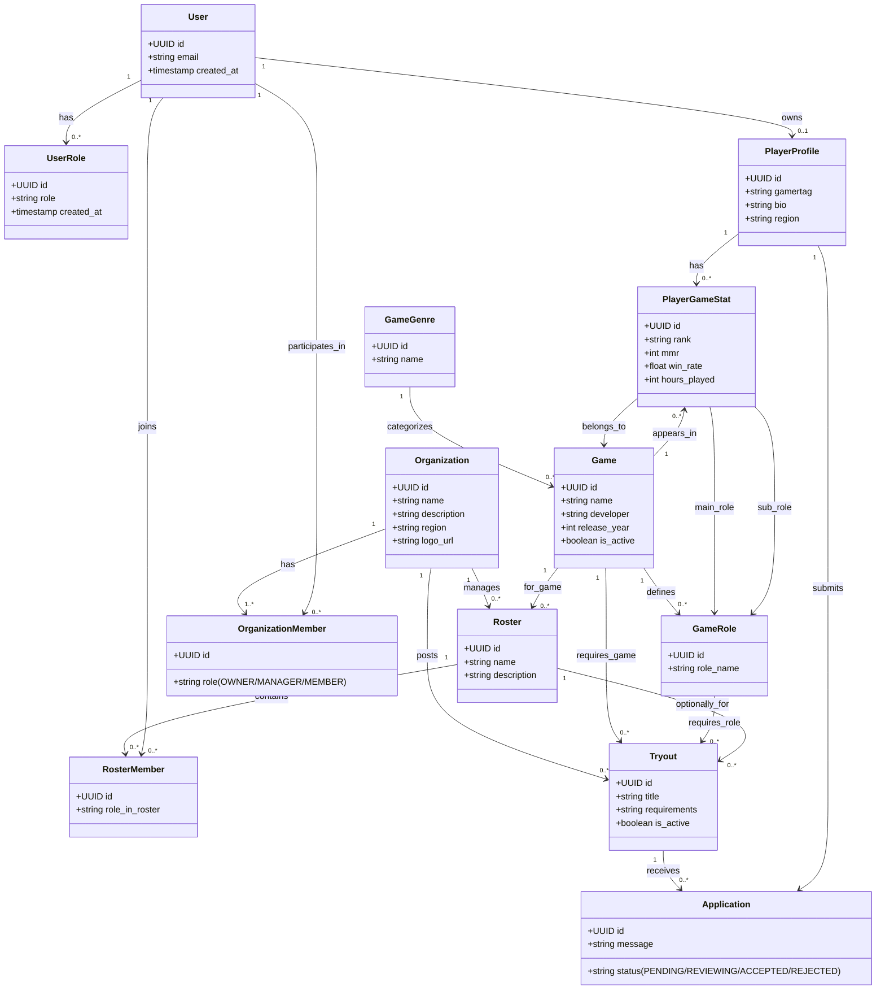

# 🗄️ GameFolio: Database Schema, Triggers, & RLS

## 1. Entity Relationship Diagram (Mermaid)



---

## 2. SQL Schema Definition

```sql
-- Enable UUID generation
CREATE EXTENSION IF NOT EXISTS "uuid-ossp";

-- ==============================
-- CORE USER TABLE
-- ==============================
CREATE TABLE users (
    id UUID PRIMARY KEY REFERENCES auth.users(id) ON DELETE CASCADE,
    email TEXT NOT NULL UNIQUE,
    created_at TIMESTAMP DEFAULT NOW()
);

CREATE TYPE user_role_type AS ENUM ('PLAYER', 'ORG_MEMBER', 'ORG_ADMIN', 'PLATFORM_ADMIN');

CREATE TABLE user_roles (
    id UUID PRIMARY KEY DEFAULT uuid_generate_v4(),
    user_id UUID NOT NULL REFERENCES users(id) ON DELETE CASCADE,
    role user_role_type NOT NULL,
    created_at TIMESTAMP DEFAULT NOW(),
    UNIQUE(user_id, role)
);

-- ==============================
-- PLAYER DOMAIN
-- ==============================
CREATE TABLE player_profiles (
    id UUID PRIMARY KEY DEFAULT uuid_generate_v4(),
    user_id UUID UNIQUE NOT NULL REFERENCES users(id) ON DELETE CASCADE,
    gamertag TEXT NOT NULL UNIQUE,
    bio TEXT,
    region TEXT,
    created_at TIMESTAMP DEFAULT NOW(),
    updated_at TIMESTAMP DEFAULT NOW()
);

-- ==============================
-- GAME CATALOG (Needs Seed Data)
-- ==============================
CREATE TABLE game_genres (
    id UUID PRIMARY KEY DEFAULT uuid_generate_v4(),
    name TEXT NOT NULL UNIQUE
);

CREATE TABLE games (
    id UUID PRIMARY KEY DEFAULT uuid_generate_v4(),
    name TEXT NOT NULL UNIQUE,
    genre_id UUID REFERENCES game_genres(id) ON DELETE SET NULL,
    developer TEXT,
    release_year INT,
    is_active BOOLEAN DEFAULT TRUE
);

CREATE TABLE game_roles (
    id UUID PRIMARY KEY DEFAULT uuid_generate_v4(),
    game_id UUID NOT NULL REFERENCES games(id) ON DELETE CASCADE,
    role_name TEXT NOT NULL,
    UNIQUE(game_id, role_name)
);

-- ==============================
-- PLAYER GAME STATS
-- ==============================
CREATE TABLE player_game_stats (
    id UUID PRIMARY KEY DEFAULT uuid_generate_v4(),
    player_profile_id UUID NOT NULL REFERENCES player_profiles(id) ON DELETE CASCADE,
    game_id UUID NOT NULL REFERENCES games(id) ON DELETE CASCADE,
    main_role_id UUID REFERENCES game_roles(id) ON DELETE SET NULL,
    sub_role_id UUID REFERENCES game_roles(id) ON DELETE SET NULL,
    rank TEXT,
    mmr INT,
    win_rate NUMERIC(5,2),
    hours_played INT,
    created_at TIMESTAMP DEFAULT NOW(),
    updated_at TIMESTAMP DEFAULT NOW(),
    UNIQUE(player_profile_id, game_id)
);

-- ==============================
-- ORGANIZATION DOMAIN
-- ==============================
CREATE TABLE organizations (
    id UUID PRIMARY KEY DEFAULT uuid_generate_v4(),
    name TEXT NOT NULL UNIQUE,
    description TEXT,
    region TEXT,
    logo_url TEXT,
    created_at TIMESTAMP DEFAULT NOW(),
    updated_at TIMESTAMP DEFAULT NOW()
);

CREATE TYPE organization_member_role AS ENUM ('OWNER', 'MANAGER', 'MEMBER');

CREATE TABLE organization_members (
    id UUID PRIMARY KEY DEFAULT uuid_generate_v4(),
    organization_id UUID NOT NULL REFERENCES organizations(id) ON DELETE CASCADE,
    user_id UUID NOT NULL REFERENCES users(id) ON DELETE CASCADE,
    role organization_member_role NOT NULL,
    joined_at TIMESTAMP DEFAULT NOW(),
    UNIQUE(organization_id, user_id)
);

-- ==============================
-- ROSTER SYSTEM
-- ==============================
CREATE TABLE rosters (
    id UUID PRIMARY KEY DEFAULT uuid_generate_v4(),
    organization_id UUID NOT NULL REFERENCES organizations(id) ON DELETE CASCADE,
    game_id UUID NOT NULL REFERENCES games(id) ON DELETE CASCADE,
    name TEXT NOT NULL,
    description TEXT,
    created_at TIMESTAMP DEFAULT NOW(),
    updated_at TIMESTAMP DEFAULT NOW(),
    UNIQUE(organization_id, game_id, name)
);

CREATE TABLE roster_members (
    id UUID PRIMARY KEY DEFAULT uuid_generate_v4(),
    roster_id UUID NOT NULL REFERENCES rosters(id) ON DELETE CASCADE,
    user_id UUID NOT NULL REFERENCES users(id) ON DELETE CASCADE,
    role_in_roster TEXT,
    joined_at TIMESTAMP DEFAULT NOW(),
    UNIQUE(roster_id, user_id)
);

-- ==============================
-- RECRUITMENT DOMAIN
-- ==============================
CREATE TABLE tryouts (
    id UUID PRIMARY KEY DEFAULT uuid_generate_v4(),
    organization_id UUID NOT NULL REFERENCES organizations(id) ON DELETE CASCADE,
    game_id UUID NOT NULL REFERENCES games(id) ON DELETE CASCADE,
    roster_id UUID REFERENCES rosters(id) ON DELETE CASCADE, 
    title TEXT NOT NULL,
    role_needed_id UUID REFERENCES game_roles(id) ON DELETE SET NULL,
    requirements TEXT,
    is_active BOOLEAN DEFAULT TRUE,
    created_at TIMESTAMP DEFAULT NOW(),
    updated_at TIMESTAMP DEFAULT NOW()
);

CREATE TYPE application_status AS ENUM ('PENDING', 'REVIEWING', 'ACCEPTED', 'REJECTED');

CREATE TABLE applications (
    id UUID PRIMARY KEY DEFAULT uuid_generate_v4(),
    tryout_id UUID NOT NULL REFERENCES tryouts(id) ON DELETE CASCADE,
    player_profile_id UUID NOT NULL REFERENCES player_profiles(id) ON DELETE CASCADE,
    status application_status DEFAULT 'PENDING' NOT NULL,
    message TEXT, 
    created_at TIMESTAMP DEFAULT NOW(),
    updated_at TIMESTAMP DEFAULT NOW(),
    UNIQUE(tryout_id, player_profile_id)
);

```

---

## 3. Automation Triggers

This trigger automatically registers the user in our core `users` table and assigns them the base `PLAYER` role upon successful Supabase authentication.
*(Note: The frontend Onboarding flow is responsible for collecting the `gamertag` and inserting into `player_profiles`)*.

```sql
CREATE OR REPLACE FUNCTION public.handle_new_user()
RETURNS trigger AS $$
BEGIN
  -- Insert base user record
  INSERT INTO public.users (id, email)
  VALUES (new.id, new.email);
  
  -- Assign default PLAYER role
  INSERT INTO public.user_roles (user_id, role)
  VALUES (new.id, 'PLAYER'::user_role_type);
  
  RETURN new;
END;
$$ LANGUAGE plpgsql SECURITY DEFINER;

CREATE TRIGGER on_auth_user_created
  AFTER INSERT ON auth.users
  FOR EACH ROW EXECUTE PROCEDURE public.handle_new_user();

```

---

## 4. Row Level Security (RLS) Checklist

To protect data, enable RLS on all tables and apply targeted policies.

```sql
-- Enable RLS across the board
ALTER TABLE public.users ENABLE ROW LEVEL SECURITY;
ALTER TABLE public.user_roles ENABLE ROW LEVEL SECURITY;
ALTER TABLE public.player_profiles ENABLE ROW LEVEL SECURITY;
ALTER TABLE public.tryouts ENABLE ROW LEVEL SECURITY;
ALTER TABLE public.applications ENABLE ROW LEVEL SECURITY;

-- Base Policies
CREATE POLICY "Users can view their own data" ON public.users FOR SELECT USING (auth.uid() = id);
CREATE POLICY "Profiles are viewable by everyone" ON public.player_profiles FOR SELECT USING (true);
CREATE POLICY "Users can update own profile" ON public.player_profiles FOR UPDATE USING (auth.uid() = user_id);
CREATE POLICY "Active tryouts viewable by everyone" ON public.tryouts FOR SELECT USING (is_active = true);
CREATE POLICY "Players can apply" ON public.applications FOR INSERT WITH CHECK (
  EXISTS (SELECT 1 FROM public.player_profiles WHERE id = applications.player_profile_id AND user_id = auth.uid())
);

```

